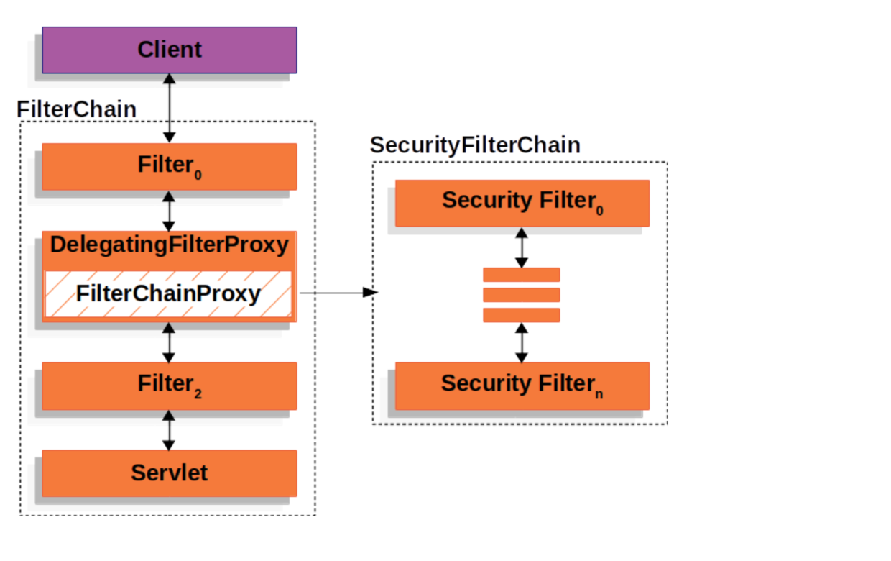

# spring-security-authentication

## 1단계 - SecurityFilterChain 적용

인터셉터로 구현한 인증 로직을 필터 형태로 변형한다.
인증 로직이 담긴 필터를 바로 서블릿 필터로 등록하지 않고 아래 이미지를 참고하여 별도의 필터 체인을 구축하여 구현한다.
주요 클래스: DelegatingFilterProxy, FilterChainProxy, SecurityFilterChain, DefaultSecurityFilterChain, VirtualFilterChain(FilterChainProxy의 내부 클래스)

### 요구 사항 
- [X]  기존 Interceptor 인증 로직 변환
    - 제공된 Interceptor 기반 인증 로직을 Filter로 변환
    - 변환된 Filter는 HttpServletRequest와 HttpServletResponse를 처리하며, 인증 여부를 결정
    - 요청이 인증되지 않은 경우, 적절한 HTTP 상태 코드(예: 401 Unauthorized) 반환
    - 인증된 사용자 정보는 요청 객체에 추가하여 이후 필터에서 접근 가능하도록 설정
- [X]  DelegatingFilterProxy 설정
    - Spring Bean으로 DelegatingFilterProxy를 등록하고 이를 통해 FilterChainProxy를 호출하도록 설정
    - DelegatingFilterProxy는 Servlet 컨테이너의 Filter와 Spring 컨텍스트를 연결
- [X]  FilterChainProxy 구현
    - FilterChainProxy는 요청 URI에 따라 적절한 SecurityFilterChain을 선택하여 실행
    - SecurityFilterChain은 Filter 리스트를 포함하며 요청을 처리
- [X]  SecurityFilterChain 리팩터링
    - 각 SecurityFilterChain은 역할에 따라 다른 필터 세트를 관리
    - 인증(Authentication) 필터와 권한(Authorization) 필터를 포함하도록 구성

